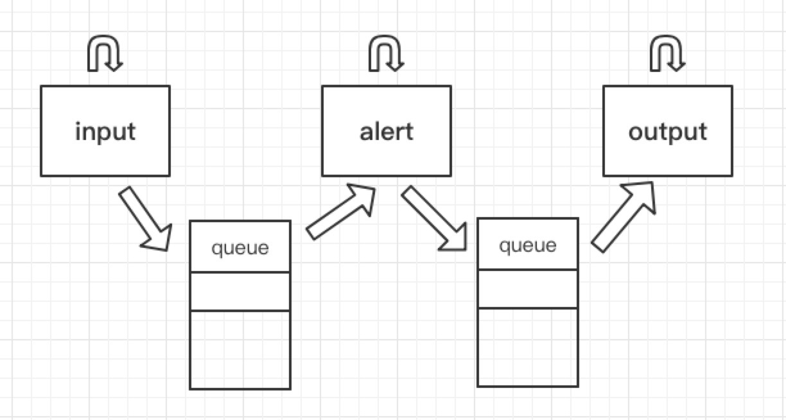

# exercise-1-modularity-zywan
## module chosing
Input module: sunithapriya     
Alert module: XiangKun Ye      
Output module: ZhiZhou Qiu      
Storage module: Zhangyu Wan(me)     
## Instruction     
Make sure mongodb is running and then run main.py
## Multithreading Achitecture

In this program, there are three Threads. input generator thread, alert thread, output thread. They comminicated with each other by mission queue.
Basically, they are running simultaneously and independant, whenever input generator generate a json file, the json file will be put into the queue, and alert can get input json file from the queue, and after some processing, the result will be put into the other queue which the output mudule can get the information from. And then the output module will output the alert message.     
Advantage: The communication between each of the two threads is quite clear by utilizing Queue
Disadvantage: Not straightward compared with impelementation by a single while true loop, and also there is no AI part in my program.
Improvement: Combine the different kind of way to implement multiThread and add AI part to my program to improve program integrity.

